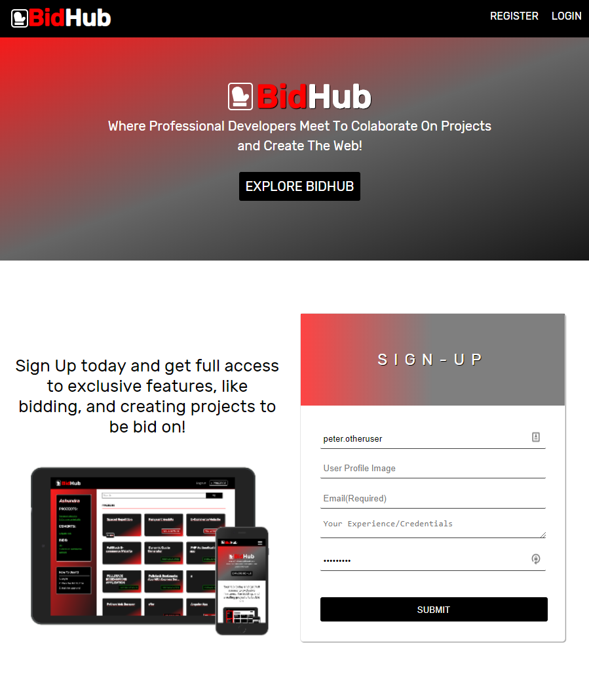
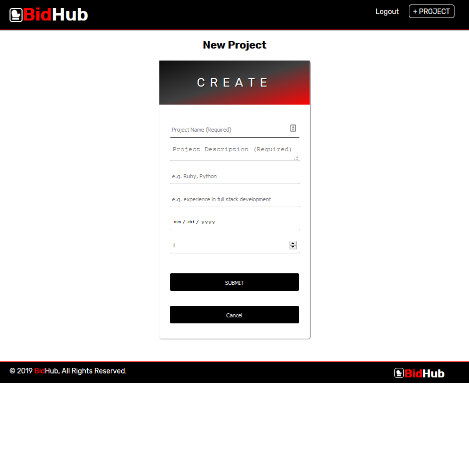

# BidHub

## Authors

### Eddie Bueno
### David Bolin
### Quonn Bernard

## Summary

A React / Express app to help developers connect and collaborate on their coding projects. Users create project descriptions and open them to bidders. Once accepted, collaboration can begin. The app allows for real time communication between collaborators on the project page.

## Live app

The live app is [here](https://bidhub.now.sh/).

## Screenshots

## Tech stack

The client uses CSS3 and JavaScript ES6 together with React.

The server is also in JavaScript (source at [https://github.com/thinkful-ei-bee/A-team-capstone-server]) and uses Express with PostgreSQL for the database.

We used [WebSockets](https://developer.mozilla.org/en-US/docs/Web/API/WebSockets_API) to allow the client to update immediately upon reception of messages from other users.

## Code base

The source folder has three sub-folders, "Components," "routes," and "services."

The routes folder contains React components for the distinct pages of our app, namely Landing, Login, Main, Project, and Registration.

The components folder contains all other React sub-components needed for the various pages.

The services folder contains the files needed for communicating with the backend.

## Installation for Development

Clone the repo and run "npm install". Then "npm start" will start the local development server. Instructions for installing the server and database, along with API documentation, can be found at the [repo for the server.](https://github.com/thinkful-ei-bee/A-team-capstone-server)
